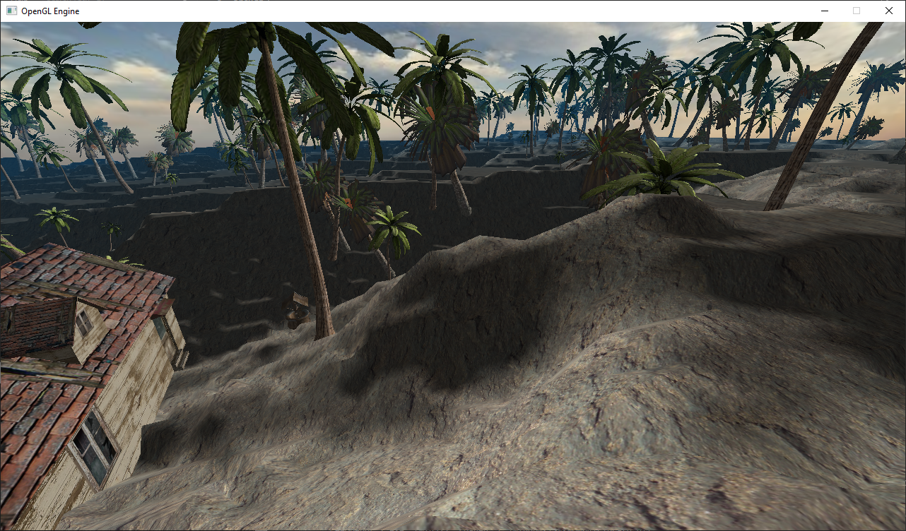
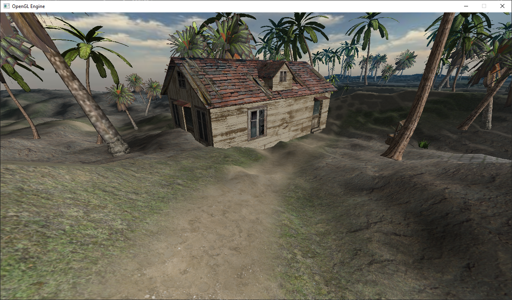

# C-OpenGL-3D-Engine

### C++ and OpenGL 3D Engine using SDL window and input manager, GLM Math library.
> GLM simplifies matrix operations such as rotation/translation/scaling and creating projection matrices.
> SDL simplifies making and updating the window, and getting user input either mouse or keyboard.
> C++ was chosen to see if preformance would be better than my other project GEngine3D using Java & LWJGL
> I chose openGL because of previous experience with it.

  
  

Implemented:
* OBJ & Texture loader
* Phong Lighting
* Terrain Generation(heightmap) and Collision
* Terrain blendmapping
* Skybox
* Crude FPS Camera
* Crude Networking (multiplayer)

To-Be Implemented:
* Normal mapping (Entity and Terrain)
* Water (reflection/refraction)
* Reflections
* Shadows
* Particle renderer
* LOD
* Object Collision

