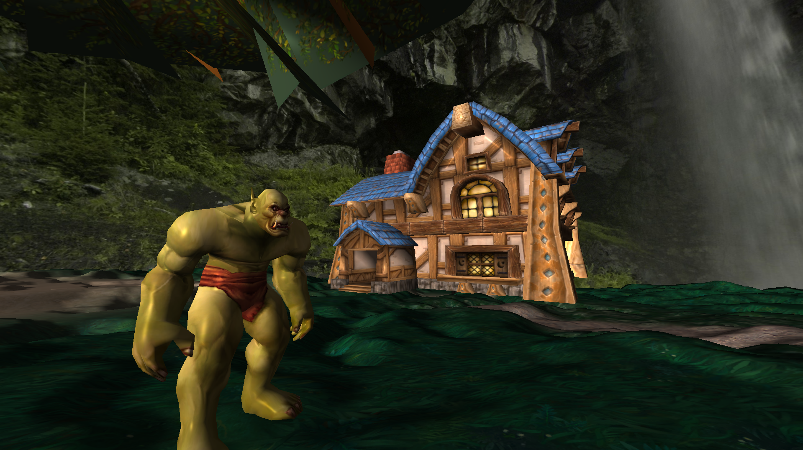
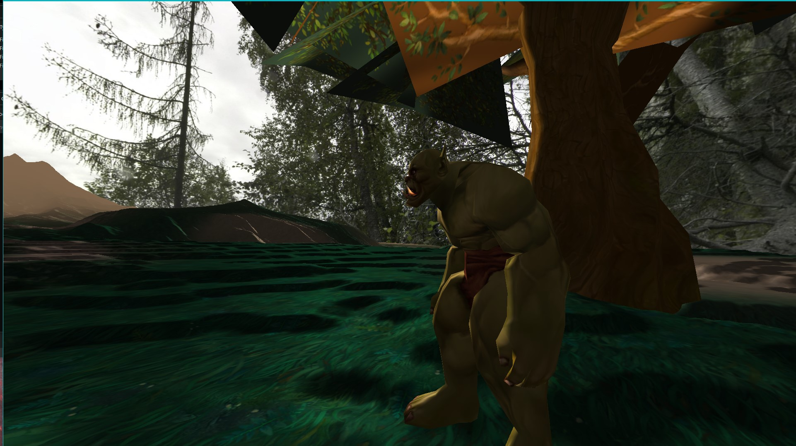

# C-OpenGL-3D-Engine

### Simple 3D Engine written in C++, using OpenGL
> <a href="https://www.assimp.org/">Assimp</a> greatly simplifies loading complex objects and meshes. 
> <a href="https://github.com/nothings/stb">stb_image.h</a> simplifies loading images/textures. 
> <a href="https://github.com/g-truc/glm">GLM</a> simplifies matrix operations such as rotation/translation/scaling and creating projection matrices.. 
> <a href="https://www.libsdl.org/">SDL</a> simplifies making and updating the window, and getting user input either mouse or keyboard.. 
> C++ was chosen to see if preformance would be better than my other project GEngine3D using Java & LWJGL. 
> OpenGL was chosen because cross-platform compatibility and a little previous experience with it.. 

  
  

## Implemented:
* Assimp Model loader
* Phong Lighting
* Terrain
  * Heightmap Generation
  * Blendmapping
  * Collision
* Skybox
* Crude FPS Camera
* Multiplayer
  * Built on UDP and TCP
  * Players can join/leave lobby freely
  * Client Authorative

## To-Be Implemented:
* Multiple light sources
* Normal mapping
  * Entity
  * Terrain
* Water
  * Reflection
  * Refraction
* Shadows 
  * Shadow Mapping
  * PFC or Percentage Closer Filtering
  * Cascading Shadow Maps)
* Particle renderer
* Text/UI renderer
* LOD (Level_Of_Detail)
  * Objects
  * Terrain
* Object Collision
* Multiplayer imporvements
  * Client Interpolation
  * Server Authorative

