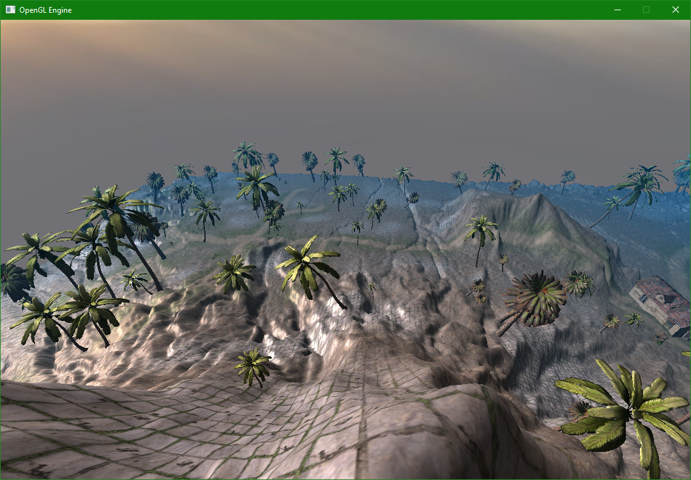

# C-OpenGL-3D-Engine

### C++ and OpenGL 3D Engine using SDL window and input manager, GLM Math library.
> GLM simplifies matrix operations such as rotation/translation/scaling and creating projection matrices.
> SDL simplifies making and updating the window, and getting user input either mouse or keyboard.
> C++ was chosen to see if preformance would be better than my other project GEngine3D using Java & LWJGL
> I chose openGL because of previous experience with it.

  
  

Implemented:
* OBJ & Texture loader
* Phong Lighting
* Terrain
  * Heightmap Generation
  * Blendmapping
  * Collision
* Skybox
* Crude FPS Camera
* Multiplayer
  * Players can join/leave lobby freely
  * Built on TCP
  * Client Authorative

To-Be Implemented:
* Normal mapping
  * Entity
  * Terrain
* Water
  * Reflection
  * Refraction
* Multiple light sources
* Shadows (Shadow Mapping -> Percentage Closer Filtering -> Cascading Shadow Maps)
* Particle renderer
* Text/UI renderer
* LOD (Level_Of_Detail)
  * Objects
  * Terrain
* Object Collision
* Multiplayer imporvements
  * Client Interpolation
  * Server Authorative
  * UDP
  * Player names

