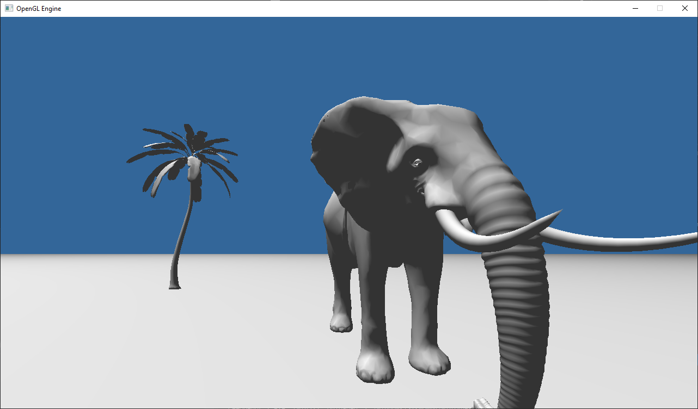

# C-OpenGL-3D-Engine

### C++ and OpenGL 3D Engine using SDL window and input manager, GLM Math library.
> GLM simplifies matrix operations such as rotation/translation/scaling and creating projection matrices.
> SDL simplifies making and updating the window, and getting user input either mouse or keyboard.
> C++ was chosen to see if preformance would be better than my other project GEngine3D using Java & LWJGL
> I chose openGL because of previous experience with it.

  
  

Implemented:
* OBJ loader (cached)
* Texture loader
* Lighting (No specular)
* Terrain (Generate from heightmap)
* Terrain Collision
* Skybox
* Crude FPS pov

To-Be Implemented:
* Water (reflection/refraction)
* Reflections
* Shadows
* Particle renderer
* LOD
* Object Collision

